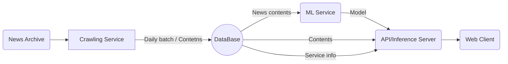

### Hi there 👋

### Skills

**Languages & Platforms**<br>
 
  
 
 


**DBMS**<br>


**TOOLS**<br>


**Project**<br>
<details>
<summary>1. Heart Project</summary>

</details> 

<details>
<summary>2. Pyspark Mini Project</summary>

## 1. 프로젝트 개요

[주제]
> 경찰청_습득물정보 조회 서비스 Api를 활용하여 데이터 적재 및 pyspark 분석
(2023. 01 ~ 2024. 01) 총 13개월 분량

참고사이트:기상데이터(https://data.kma.go.kr/climate/RankState/selectRankStatisticsDivisionList.do?pgmNo=179)
<br/>
<br/>
## 2. 분석 아키텍처
- OS : AWS (ubuntu) t2.large * 3


- 저장소 : Hadoop


<br>
- 분석도구 : JupyterLab(python, pyspark)<br>
- Api : [경찰청_습득물정보 조회 서비스](https://www.data.go.kr/tcs/dss/selectApiDataDetailView.do?publicDataPk=15058696), 카카오 맵 api<br>
    - 시각화도구 : Tableau Public
<br/>
<br/>
## 3. 분석 flow<br>
1. 데이터 수집 및 적재
    a. Id 수집 → hdfs 적재
   
   b.수집된 id 기반 상세정보 수집 → hdfs 적재
   

1. 데이터 전처리
    a. 컬럼 분할
    b. 도로명주소 변환 api 적용
2. 데이터 분석 
    a. 외부 기상데이터 병합
    b. pyspark 분석
3. 시각화
    a. tableau public
<br/>
<br/>
## 4. 대시보드 시연
https://public.tableau.com/app/profile/hyeonu.kim5342/viz/23_17062509031730/sheet0

## 5. 트러블슈팅 
- AWS EMR의 운영체제가 익숙하던 ubuntu가 아니어서 당황스러웠음
    - AMI 이미지로 output해서 3개의 노드로 연결하는 방식으로 구조를 변경하였습니다.
- Spark 구동에 필요한 파이썬 버전이 메인노드와 워커노드가 달랐음
    - 메인노드(client)에만 conda를 써서 발생한 문제. 가상환경의 파이썬 버전을 다운그레이드하고 주피터를 재설치하여 해결
- 정확한 주소로 변환하는 api를 찾기 어려웠음
    - 최초 기획은 구 단위가 아닌 동 단위 수준까지 수집하는 것이 목표였음.
    - POI를 input하면 정확한 지번주소로 return 하는 api가 필요했지만, 대개는 기업 상대로 제공하는 유료 api였음
    - 카카오 api의 검색기능을 이용하면 POI를 input했을 때 각종 검색결과들의 주소를 return 받을 수 있었고, 첫번째 장소의 주소를 저장하는 방식으로 구현하였음
    - 그러나, 주소의 형식이 랜덤하게 지번 주소 또는 도로명 주소로 저장되어 일정하지 않았음. (두번째 장소까지 받아온 다음에 지번 주소만 저장하는 방식으로 구현하였으나 예외가 너무 많았음)
    - 아쉽지만 구 단위 분석으로 기획 변경
<br/>
<br/>
</details> 

<details>
<summary>3. Poppin' Final Project</summary>
 
# :pushpin: POPPIN'


## WE CONNECT POP-UP CULTURE

"팝핀"은 **팝업 스토어 데이터를 한 곳에 모아 검색 및 저장**하고, 저장된 팝업스토어를 기반으로 **새로운 팝업 스토어를 추천**받을 수 있는 `팝업 스토어 정보 저장 & 추천 모바일 웹 서비스`입니다

[:arrow_right:팝핀 사이트 바로가기](https://pop-pin.store/)

위 사이트는 모바일에 최적화되어있습니다.

## :family: **TEAM**

|                                  [:crown:김현우](https://github.com/kim-edwin)                                  |                                [:smiley_cat:강희림](https://github.com/limmyou)                                 |                             [:hatching_chick:장경민](https://github.com/wkdrudals)                              |                                 [:rabbit:이윤아](https://github.com/YoooonaLee)                                 |                                   [:pizza:최민환](https://github.com/Hwannni)                                   |
| :-------------------------------------------------------------------------------------------------------------: | :-------------------------------------------------------------------------------------------------------------: | :-------------------------------------------------------------------------------------------------------------: | :-------------------------------------------------------------------------------------------------------------: | :-------------------------------------------------------------------------------------------------------------: |
|  |  |  |  |  |
|                                                  `Full stack`                                                   |                                                 `Data Analysis`                                                 |                                                   `Back-end`                                                    |                                                    `Modeler`                                                    |                                                    `Modeler`                                                    |
|                                            `AWS`, `React`, `Django`                                             |                                                `Python, MariaDB`                                                |                                                `Python, Airflow`                                                |                                                       ` `                                                       |                                           `Python, tensorflow, keras`                                           |

<br/>
<br/>

## 1. 프로젝트 개요

[팝업스토어란?]

> 팝업스토어는 짧은 기간 운영되는 오프라인 소매점이며, `자사 브랜드를 홍보`하기 위한 수단으로서 개설하는 경우가 대부분입니다. 때문에 상품만 판매하는 것이 아니라 전시공간이나 체험관 등을 팝업스토어 내에 마련하는 등 브랜드의 요소를 많이 가미하여 만듭니다.

> '더 현대 서울', '성수동' 등 MZ 세대들의 핫플레이스를 중심으로 `최근 폭발적으로 성장`하고 있습니다.

[문제현상]

> 많은 브랜드들이 앞다투어 팝업스토어 시장에 뛰어들고 있음에도 불구하고, `팝업스토어를 홍보하는 채널은 개인이 운영하는 블로그나 SNS 피드에 의존`하고 있습니다. 이러한 폐쇄적인 구조에서 `브랜드와 고객간의 정보 불평등`이 발생되고 있고 소비자가 `다양한 팝업스토어를 접할 기회가 상실`되고 있다는 점에 저희는 주목하였습니다.

[솔루션]

> 팝업 스토어에 대한 `종합적인 정보를 제공하고 추천하는 모바일 웹 서비스`를 구축함으로써, 고객들이 원하는 팝업 스토어를 손쉽게 찾을 수 있도록 지원하며, 개인화된 추천 시스템을 구축하여 고객들의 취향과 관심사에 맞춘 새로운 팝업 스토어를 발견할 수 있도록 합니다. 기업들에게는 `효율적인 팝업 스토어 홍보 채널을 제공`하여 고객에게 보다 직접적으로 접근할 수 있도록 하여 `마케팅 효과를 극대화`하도록 합니다.

> 본 프로젝트는 상품성 또한 염두에 두었습니다. `브랜드와의 제휴를 통해 광고 수익`을 얻을 수 있으며, `데이터 수집 전 과정을 자동화` 를 통해 인건비를 절감시킬 수 있습니다.
<br/>
<br/>

## 2. 주요 기능

**:triangular_flag_on_post:팝업 스토어 정보**

```
현재 진행중/예정중인 팝업 스토어
- 팝업 스토어 상세 정보 (기간, 위치, 해시태그)
- 유저 이용후기
- URL 공유
```

**:mag_right:팝업 스토어 검색 기능**

```
- 키워드 검색
- 날짜 선택
- 지역 선택
```

**:thumbsup:팝업 스토어 추천 기능**

```
위치 기반 추천
콘텐츠 기반 추천 (연관 팝업스토어 추천)
사용자 기반 추천 (선호하는 팝업스토어 기반 추천)
```

**:eyes:최근 조회한 스토어**

```
최근 조회한 스토어 목록
```

**:hearts:위시리스트**

```
좋아요한 스토어 목록
```
<br/>
<br/>

## 3. 기획 및 개발 일정 (WBS) 

> 기획, 설계, 디자인, 백엔드, 프론트엔드, 프로젝트 정리의 6가지 카테고리로 Task를 구분짓고 일정을 할당하였습니다. 

[프로젝트 기획서 확인하기](https://repeated-sidewalk-fe0.notion.site/05d18d404f0d413583dae72d61e7f53b?pvs=4)

[WBS 확인하기](https://docs.google.com/spreadsheets/d/1B9ElpTqgXPPfNXbQ8e2fhkwKi8PkeVj9/edit?usp=sharing&ouid=115893901626478389096&rtpof=true&sd=true)


<br/>
<br/>

## 4. 개발

### 기술스택


**Environment**<br>


**Development**<br>


**Deployment**<br>


**DBMS**<br>


<br/>
<br/>


### 시스템 아키텍처

> 백엔드 서버는 Django Rest Framework를 사용하였고 웹은 React로 구현하였습니다. 

> 데이터 수집 자동화 및 적재를 위해 EC2 인스턴스를 활용하였습니다.


<br/>
<br/>


### 모델

> 현재 보고 있는 팝업스토어와 유사한 팝업스토어를 추천하기 위해 FastText와 Cosine Similarity를 통해 컨텐츠 기반 필터링 모델을 구현하였습니다.

> 또한, 사용자의 후기 및 평점을 기반으로 팝업스토어를 추천해주기 위해 Keras를 사용하여 협업 필터링 모델을 구현하였습니다.


:arrow_right: 모델 설계서 [확인하기](https://repeated-sidewalk-fe0.notion.site/a65bc33b48dc488aac44eabf462dbadb)


<br/>
<br/>

### UI

> 초기에는 pc 웹 기준으로 구현하였으나, 모바일 이용자가 더 많을 것 같다는 판단하에 모바일 웹 사이트로 전환하였습니다. 

> React 환경에서 적용이 우수한 Chakra UI를 사용하여 구현하였습니다.


:arrow_right: 화면 정의서 [확인하기](https://repeated-sidewalk-fe0.notion.site/5669337e534e4bf3992bddacb22ae52e)


<br/>
<br/>

### API

> Django Rest Framework의 APIView 라이브러리를 활용하여 API 서버를 구축하였고 Render 서비스를 이용해 배포하였습니다. 


:arrow_right: API 정의서 [확인하기](https://repeated-sidewalk-fe0.notion.site/API-4deebee8804c43caa68b1657e631126e)

<br/>
<br/>

## 5. 발표자료


[팀 팝핀_발표자료_최종.pdf](https://github.com/kim-edwin/repopoppin-frontend/files/14731324/_._.pdf)

<br/>
<br/>

## 6. 발표영상

### 발표영상
[](https://youtu.be/9O1aDqaiPWU)

### 피드백영상
[](https://youtu.be/D_p8ycRy0HM)
</details>


<!--
**wkdrudals/wkdrudals** is a ✨ _special_ ✨ repository because its `README.md` (this file) appears on your GitHub profile.

Here are some ideas to get you started:
- 🔭 I’m currently working on ...
- 🌱 I’m currently learning ...
- 👯 I’m looking to collaborate on ...
- 🤔 I’m looking for help with ...
- 💬 Ask me about ...
- 📫 How to reach me: ...
- 😄 Pronouns: ...
- ⚡ Fun fact: ...
-->

